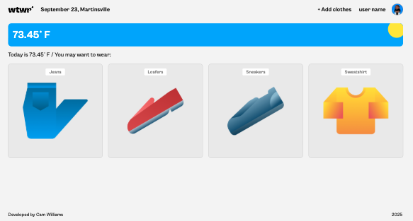

# What to Wear, Weather App

### **wtwr** is a weather app that gives you clothing suggestions based on the weather (checked at load) and the clothing that you add to your virtual wardrobe! Perfect for anyone who has trouble choosing outfits!

### Technologies Utilized

- React (hooks and component based file structure)
- Javascript (in the form of JSX)
- HTML & CSS
- Vite Build and NPM

### How to run it

- I will be adding this to Github pages in the future, with the link to follow soon!

### Visuals

#### More to come as I continue to improve this application!
